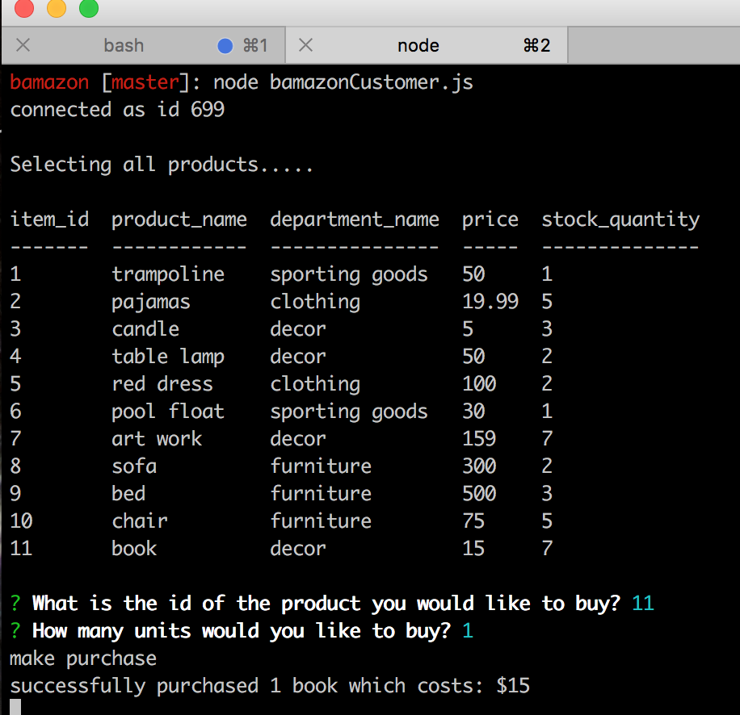
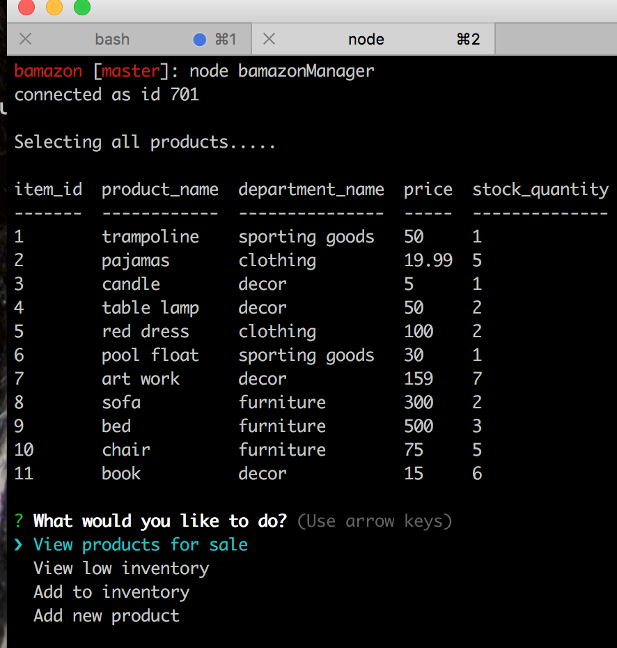
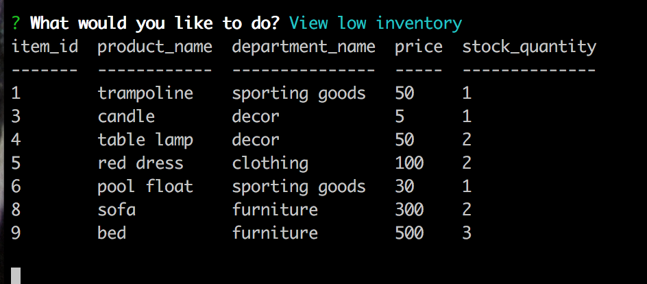
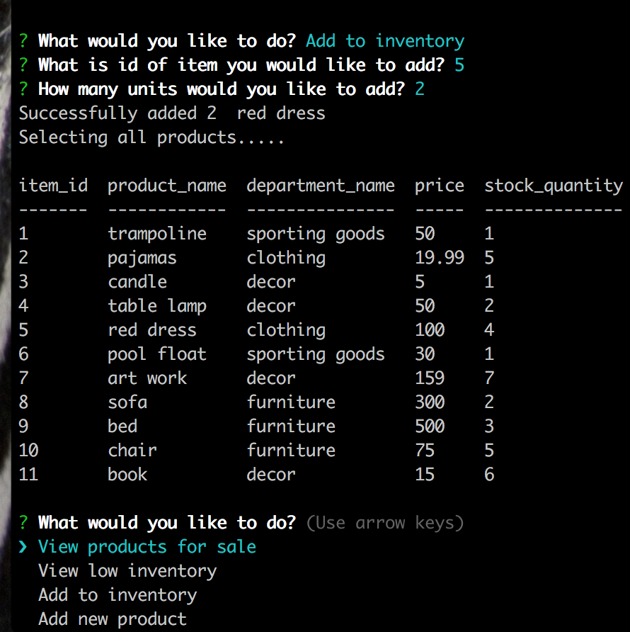
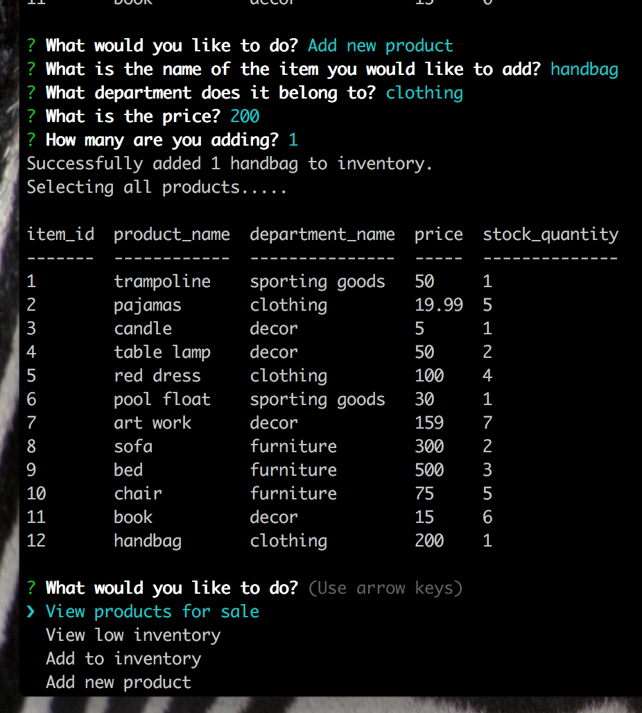

# bamazon
Node.js &amp; MySQL e-commerce app<br>

## About The Project
Bamazon is an Amazon-like storefront using MySQL and Node. The app will take in orders from customers and deplete stock from the store's inventory.

### Built With
* Javascript
* Node.js
* npm
* MySQL
* Inquirer

## Getting Started
### Prerequisites
* [Node.js](https://nodejs.org/en/)
* [npm](https://npmjs.com/getnpm)
* [MySQL](#)

### Installation
1. Make sure you have MySQL.
2. Clone the repo
```sh
git clone https://github.com/mpieces/bamazon.git
```
3. Use bamazon.sql to set up the database
4. Create a file named .env and add the following to it, replacing the values with your own database information.
```sh
# Server Information
DB_HOST="YourServerName"
DB_USER="YourDBUserName"
DB_PW="YourDBPassword"
```
5. Install NPM packages in root directory
```sh
npm install
```

## Usage
1. Customer View: `node bamazonCustomer.js`
2. Manager View: `node bamazonManager.js`

## Screenshots:






## Contact
Marisa Ramon - [LinkedIn](https://www.linkedin.com/in/marisaramon/) - mer0522@gmail.com


